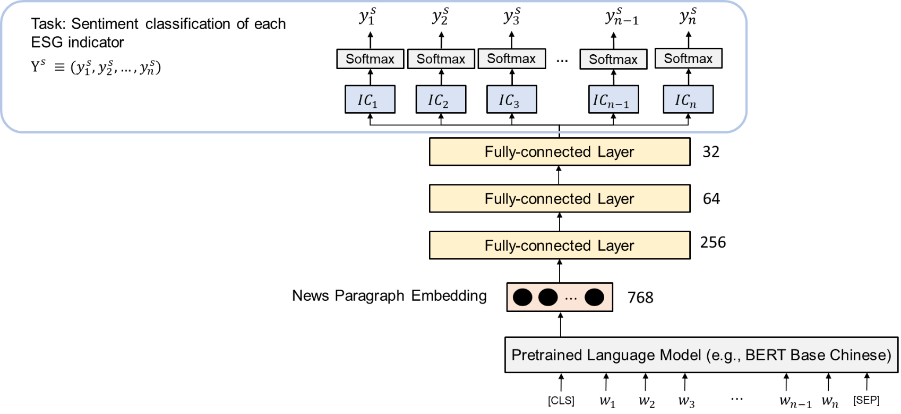
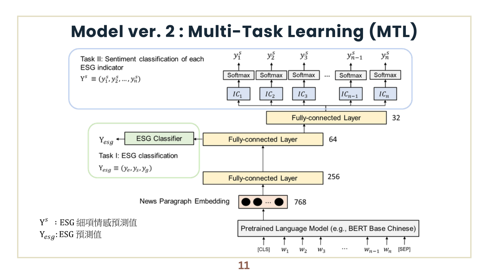
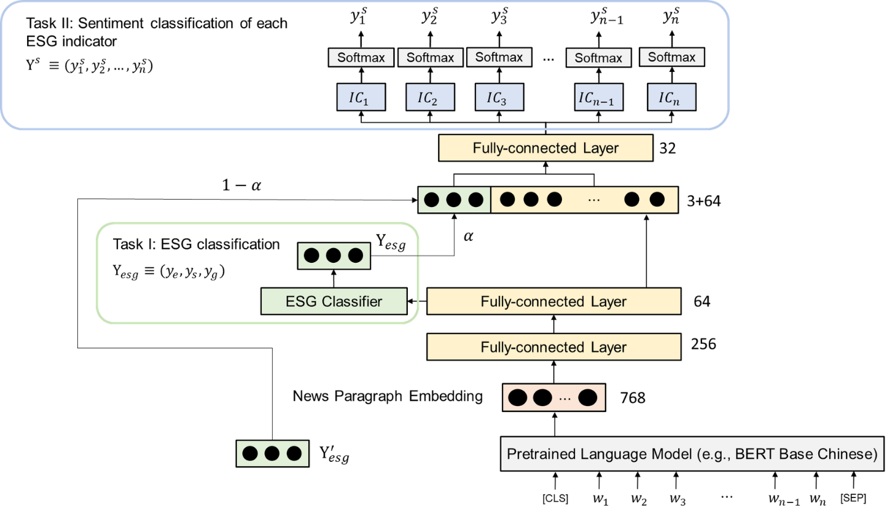

# ESGer

ESGer is a news-based ESG analysis system developed as a 2023 university capstone project. It explores how natural language processing can help analyze corporate performance across environmental, social, and governance dimensions.

Instead of relying only on company-published sustainability reports, ESGer uses news coverage as an additional third-party information source. The system identifies ESG-related content, classifies detailed topics and sentiment, and converts the results into company-level ESG indicators.

## Motivation

Traditional ESG assessment often requires substantial time and professional review, while company-provided information may be selective or updated only periodically. News articles offer a comparatively dynamic source that can reflect events, controversies, and corporate actions as they occur.

ESGer was designed to investigate whether these articles could provide useful supporting signals for:

- evaluating companies and supply-chain partners;
- comparing ESG performance across companies;
- supplementing existing certification and assessment processes;
- supporting corporate and financial decision-making.

## System workflow

```text
Corporate news collection
          |
          v
Paragraph segmentation and annotation
          |
          v
ESG relevance filtering
          |
          v
Topic and sentiment classification
          |
          v
Company-level ESG indicators
```

The complete project included news collection, paragraph annotation, model training, ESG score calculation, company comparison, and a user-facing system.

## Dataset and labels

According to the final project presentation, the team collected 2,238 Taiwanese corporate news articles and produced 17,419 annotated paragraphs.

The labeling process covered:

- the broad environmental, social, and governance dimensions;
- detailed indicators within each dimension;
- positive, negative, or unrelated sentiment for each detailed indicator.

The dataset was challenging because ESG-related examples were limited, unrelated paragraphs were common, class distributions were imbalanced, and some annotation decisions were inherently subjective.

## Model architecture

The model pipeline used `bert-base-chinese` to generate a 768-dimensional representation for each news paragraph. Several downstream neural-network designs were evaluated.

### Version 1: Baseline classifier

The baseline passed the BERT representation through fully connected layers and predicted the sentiment class of each detailed ESG indicator.



### Version 2: Multi-task learning

The second version introduced an auxiliary task that predicted the paragraph's broad E/S/G dimensions. This auxiliary signal was combined with the shared representation for detailed indicator classification.



### Version 3: Multi-task learning with teacher forcing

The third version mixed the predicted broad E/S/G signal with its ground-truth label during training. The teacher-forcing ratio controlled how much ground-truth information was supplied to the detailed prediction stage.



*Architecture figures are preserved from the original 2023 team presentation.*

### Notation

- $Y^s = (y_1^s, y_2^s, \ldots, y_n^s)$ denotes the predicted sentiment labels for the detailed ESG indicators.
- $y_i^s$ is the predicted sentiment label for the $i$-th ESG indicator.
- $Y_{esg} = (y_e, y_s, y_g)$ denotes the model's predicted environmental, social, and governance labels.
- $Y'_{esg}$ denotes the corresponding ground-truth E/S/G labels used during teacher forcing.
- $\alpha$ is the teacher-forcing ratio. The model combines $\alpha Y'_{esg}$ with $(1-\alpha)Y_{esg}$ before detailed classification.
- $IC_i$ denotes the classifier head for the $i$-th detailed ESG indicator.

## Results

The final presentation reported the following F1 scores using 10-fold cross-validation:

| Model | Mean F1 | Highest | Lowest |
|---|---:|---:|---:|
| Baseline | 0.38 | 0.72 | 0.16 |
| Multi-task learning | 0.46 | 0.60 | 0.28 |
| MTL + teacher forcing | 0.47 | 0.70 | 0.37 |

Multi-task learning improved the average result and reduced the lowest fold score. Adding teacher forcing produced the highest mean F1 among the three experiments. The remaining variation across folds reflects the limited and imbalanced dataset as well as annotation inconsistency.

## Core notebooks

This repository preserves the core modeling notebooks that remain from the original system. They cover text representation, ESG relevance filtering, model experiments, and the multi-task teacher-forcing architecture.

| Notebook | Purpose |
|---|---|
| [`bert_embedding.ipynb`](bert_embedding.ipynb) | Prepares model labels and generates Chinese BERT paragraph embeddings. |
| [`esg_relevance_filter.ipynb`](esg_relevance_filter.ipynb) | Experiments with filtering ESG-related and unrelated paragraphs. |
| [`esg_model_experiments.ipynb`](esg_model_experiments.ipynb) | Contains the main ESG classification and cross-validation experiments. |
| [`multitask_teacher_forcing.ipynb`](multitask_teacher_forcing.ipynb) | Implements the multi-task and teacher-forcing model design. |

These notebooks preserve the original code and experiment structure. Saved execution outputs were removed to keep the repository focused on the core implementation.

## Repository scope

This is not the complete ESGer application repository. It focuses on the surviving model-side modules; the original crawler, labeled datasets, trained checkpoints, scoring implementation, and user interface are not included.

The notebooks refer to Google Colab and Google Drive paths used during development. Because the original input files are no longer available, the experiments cannot currently be reproduced end to end from this repository alone.

Some surviving artifacts also represent different stages of experimentation. For example, the final presentation describes 12 detailed categories, while some notebook code contains 22 detailed output heads. These differences are retained as part of the original experimental record rather than retroactively rewritten.

## Team contribution

ESGer was developed collaboratively by a five-person team. I contributed extensively to the modeling work, including BERT representations, classifier development, multi-task learning, teacher-forcing experiments, and evaluation. These components were developed through team collaboration rather than as independent work.

## Disclaimer

ESGer is an academic prototype. Its news-derived indicators are not audited ESG ratings and should not be interpreted as financial or investment advice.

## License

No open-source license has been assigned. Until ownership and contributor consent for the team materials are confirmed, all rights are reserved.
